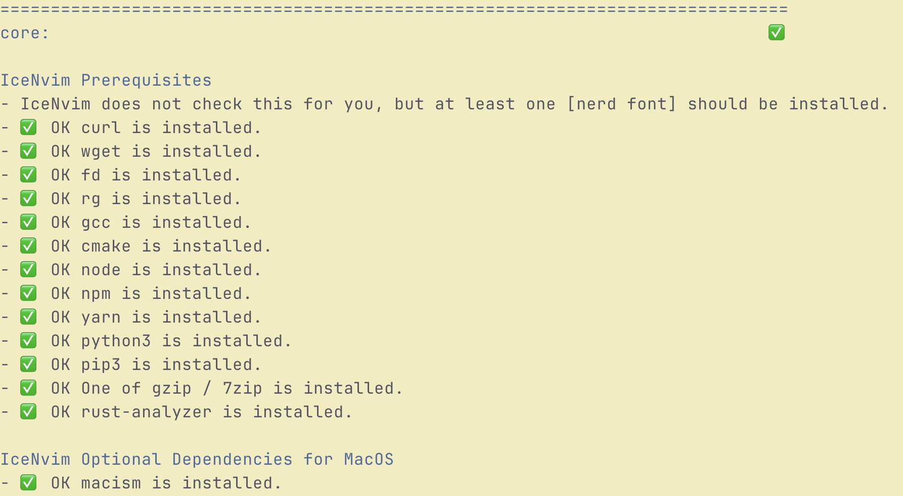
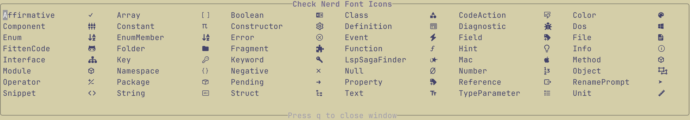

IceNvim requires the latest stable version of neovim to run. This means that you will need neovim >= **0.11.0**.

## Prerequisites

To get IceNvim running, you need to have these dependencies installed: 

- git
- a [nerd font](https://www.nerdfonts.com/font-downloads)
- curl
- fd
- gcc
- cmake
- gzip or 7zip
- node and npm
- tree-sitter-cli
- yarn
- python3 and pip3
- ripgrep
- wget

Also, if you are using Linux, you will be needing these:

- unzip
- python virtual environment
- xclip (not required on WSL)
- zip

<details>
    <summary>Installing dependencies on different systems</summary>

MacOS:

```bash
brew install wget fd ripgrep node yarn cmake tree-sitter-cli
```

Arch:

```bash
sudo pacman -S --needed curl gzip wget fd ripgrep gcc nodejs npm python python-pip unzip zip xclip python-virtualenv tree-sitter-cli
```

Windows (via scoop):

```bash
scoop install curl gzip wget fd ripgrep mingw nodejs-lts python
```

</details>

## Installing IceNvim

On Windows:

`git clone https://github.com/Shaobin-Jiang/IceNvim "$env:LOCALAPPDATA\nvim"`

On MacOS / Linux:

`git clone https://github.com/Shaobin-Jiang/IceNvim ~/.config/nvim`

As a precaution, you should check whether the prerequisites from the previous section are all installed. Of course, missing dependencies does not really crash your computer, but it does make hell of a mess. Therefore, when the cloning is done, start neovim with `nvim --noplugin` and run the `:IceHealth` command. It should inform you of any missing dependency.



You can also check whether the nerd font is correctly used by running the `IceCheckIcons` command, which ought to display the icons like below:



With everything ready, you can now restart neovim with `nvim` (no `noplugin` flag this time). IceNvim will automatically install some plugins for you, as well as treesitter parsers and language servers. Wait till these are finished, and you can get started with using IceNvim.

## Optional Installation

### Automatic IME Switching

For users who use IME a lot, switching modes in neovim can be a pain in the \*\*\*. IceNvim deals with this by automatically switching the input method to English when it is not in insert mode.

For Windows / WSL, to enable this functionality, [im-select.exe](https://github.com/daipeihust/im-select/raw/master/win/out/x86/im-select.exe) will be needed. Place the executable in the `bin` directory in the neovim configuration directory. You will need to create one if there is no such directory.

Additionally, if you are using wsl, you might have to do this:

```bash
chmod +x ~/.config/nvim/bin/im-select.exe
```

For MacOS, you will need to install [macism](https://github.com/laishulu/macism). It can be installed with homebrew:

```bash
brew tap laishulu/homebrew
brew install macism
```

For Linux, IME switching is also supported for Fcitx5.

### Unicode Yanking

Although text yanked from within IceNvim is already available from outside, one might find that utf-8 characters are not copied properly on Windows and WSL. This is because the functionality is dealt with by Windows' `CLIP` command which does a poor job when used with unicode characters.

To solve this, one might need to download [uclip.exe](https://github.com/suzusime/uclip/releases/download/v0.1.0/uclip.exe) and place it in the `bin` directory in the neovim configuration directory.

Additionally, if you are using wsl, you might have to do this:

```bash
chmod +x ~/.config/nvim/bin/uclip.exe
```

## Language-Specific Installation

### C\# Development

IceNvim uses Omnisharp and Csharpier for C\# development. If you want to use IceNvim for C\# development, make sure that you have dotnet sdk installed.

If you are receiving nuget-related errors when installing csharpier, you might have to configure nuget source by running this command:

```bash
dotnet nuget add source https://api.nuget.org/v3/index.json -n nuget.org
```

### Rust Development

If you want to use IceNvim for rust development, you will need to install rust-analyzer. The recommended way is to install rustup.

## Troubleshooting

### Mason Registry Refreshing Failed

This might be due to the use of proxies. Shut down softwares of such kind and run the `:Mason` command. The interface that pops up will prompt you on how to refresh the registry again.
